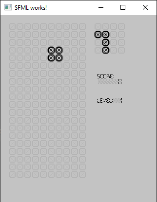

# mvi-tetris
Игра тетрис (графика на библиотеке SFML)




# Сборка

## Windows

1. Установите компилятор (проще поставить Microsoft Visual Studio)
2. Установите CMake >=3.14

> Если у вас Microsoft Visual Studio
3. Откройте пуск
4. Найдите и запустите `x64 Native tools command prompt`
5. В открывшемся терминале:
```cmd

cd ./Path/Repo/mvi-tetris
mkdir build
cd build

cmake ../
cmake --build .
cpack -G ZIP
```

6. Внутри `./Path/Repo/mvi-tetris/build/` будет архив с игрой. Можно распаковать в какую-то папку и запустить `./bin/mvi-tetris.exe`


## Linux
```shell
sudo apt install build-essential cmake

cd ./mvi-tetris
mkdir build

cd build
cmake ../
cmake --build .
cpack -G ZIP
```

Внутри `./mvi-tetris/build/` будет архив с игрой. Можно распаковать в какую-то папку и запустить `./bin/mvi-tetris`